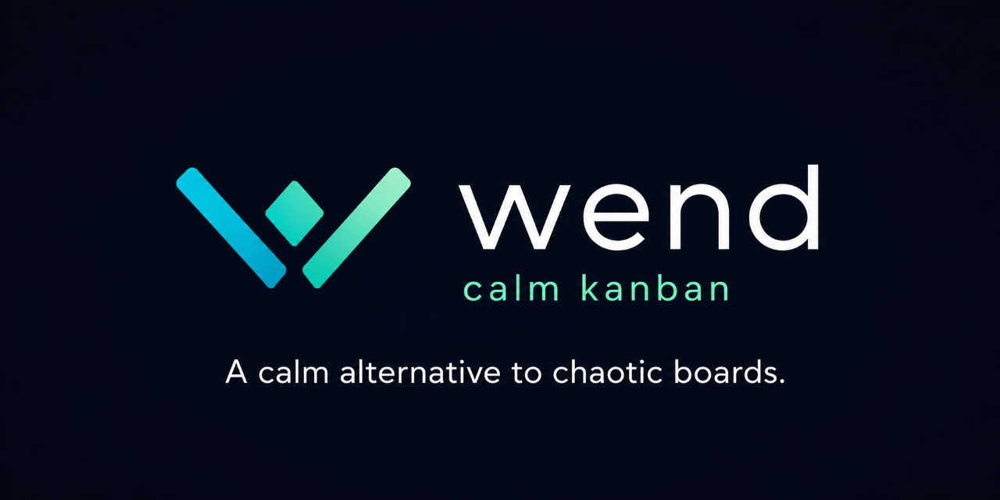

<div align="center">
  
</div>

# Wend

[](https://github.com/wendhq/wend/actions/workflows/ci.yml)

A free, open-source, accessible, dark-mode-first kanban board — a calm alternative to Trello. Built by Malin Fossum and Henry Elendheim as a learning project for GET Prepared.

## Status

**Slice 1 — local single-user board (in progress).**

Boards, lists, and cards work end to end — create, rename, delete, and reorder lists inside a board, add cards to a list, move a card within its list or to another list, mark a card done, label them, delete a card with a one-click undo, and open a card into a focused task view to edit its title, notes, due date, and labels — saved to SQLite, accessible and dark-mode-first.

- **Done:** the board, list, card, and label backend (JSON APIs behind `IBoardRepository`, `IListRepository`, `ICardRepository`, and `ILabelRepository` seams, EF Core + SQLite, 124 NUnit tests, localhost-only) and the vanilla-JS MVC frontend (board-view navigation, accessible list reordering, card chips with a focused task view, accessible card moving with up/down buttons and a move-to-list dropdown, an inline label picker with soft-tint chips on cards and the board, a done checkbox that tucks completed cards into a collapsible per-board Done area, an undo-first card delete with a transient "Deleted · Undo" toast, screen-reader announcements, keyboard focus management).
- **Next:** a per-card checklist, then mobile + accessibility polish.

Design specs: [`docs/2026-06-15-wend-slice1-design.md`](docs/2026-06-15-wend-slice1-design.md), [`docs/2026-06-19-wend-lists-design.md`](docs/2026-06-19-wend-lists-design.md), [`docs/2026-06-22-wend-cards-design.md`](docs/2026-06-22-wend-cards-design.md), [`docs/2026-06-23-wend-labels-design.md`](docs/2026-06-23-wend-labels-design.md), [`docs/2026-06-24-wend-card-moving-design.md`](docs/2026-06-24-wend-card-moving-design.md), [`docs/2026-06-25-wend-done-design.md`](docs/2026-06-25-wend-done-design.md), [`docs/2026-07-07-wend-delete-undo-design.md`](docs/2026-07-07-wend-delete-undo-design.md) · Build plans: [`docs/plans/2026-06-16-slice1-foundation-boards.md`](docs/plans/2026-06-16-slice1-foundation-boards.md), [`docs/plans/2026-06-19-slice1-lists.md`](docs/plans/2026-06-19-slice1-lists.md), [`docs/plans/2026-06-22-slice1-cards.md`](docs/plans/2026-06-22-slice1-cards.md), [`docs/plans/2026-06-23-slice1-labels.md`](docs/plans/2026-06-23-slice1-labels.md), [`docs/plans/2026-06-24-slice1-card-moving.md`](docs/plans/2026-06-24-slice1-card-moving.md), [`docs/plans/2026-06-25-slice1-done.md`](docs/plans/2026-06-25-slice1-done.md), [`docs/plans/2026-07-07-slice1-delete-undo.md`](docs/plans/2026-07-07-slice1-delete-undo.md)

## Stack

- ASP.NET Core (`net10.0`) — minimal API, localhost only
- EF Core → SQLite for storage, behind an `IBoardRepository` seam
- Vanilla-JavaScript MVC frontend, served from `wwwroot`
- NUnit tests

## Structure

| Project | Responsibility |
|---|---|
| `Wend.Core` | Board domain, the `IBoardRepository` seam, EF Core data access |
| `Wend.Api` | Minimal API endpoints; serves the frontend |
| `Wend.Tests` | NUnit tests covering Core and the API |

## Run it

```
dotnet run --project Wend.Api
```

Then open http://127.0.0.1:5174 to create boards, open one to manage its lists (create, rename, delete, reorder), add cards and move them within or between lists — open a card for its task view to edit the title, notes, due date, and labels. The API lives under `/api/boards`, `/api/lists`, `/api/cards`, and `/api/labels`. On first run the SQLite database is created at `%LOCALAPPDATA%\Wend\data.db`.

## Tests

```
dotnet test
```

## License

[MIT](LICENSE) © 2026 Malin Fossum and Henry Elendheim
