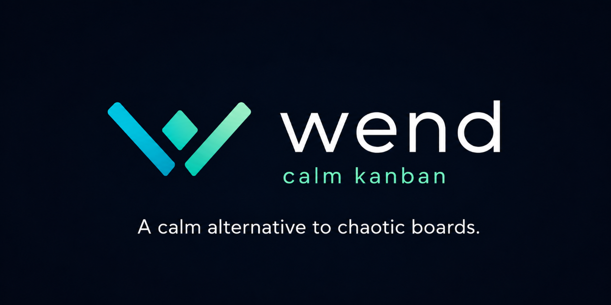

<div align="center">
  
</div>

# Wend

[](https://github.com/wendhq/wend/actions/workflows/ci.yml)

A free, open-source, accessible, dark-mode-first kanban board — a calm alternative to Trello. Built by
Malin Fossum and Henry Elendheim.

## Status

**Slice 1 (local single-user board) is complete. Slice 2a (accounts and identity) is in progress.**

Boards, lists, cards, labels and per-card checklists all work end to end, with undo-first deletes,
keyboard operation and screen-reader announcements throughout. On top of that, Wend now has real
accounts: register with an email address and a display name, confirm it from an emailed link, sign in,
and every board belongs to you alone — a board you do not own answers 404, not 403. A forgotten
password is recoverable, and completing a reset signs out every live session for that account.

Still to come in 2a: account settings, account deletion, security hardening, deployment. Then Slice
2b — sharing, board membership and invitations.

> **Wend is localhost only and is not deployed.** `/api/auth/*` is not yet rate limited. That is a
> deliberate, tracked gate — security hardening lands before Wend is ever exposed. See
> [`docs/backlog.md`](docs/backlog.md).

Design docs and build plans live in [`docs/`](docs).

## Stack

- ASP.NET Core (`net10.0`) — minimal API, localhost only
- ASP.NET Core Identity with cookie sessions, behind hand-written `/api/auth/*` endpoints — no
  scaffolded Identity UI, so the frontend keeps its no-build-step, accessibility-first character
- EF Core → PostgreSQL for storage, with EF migrations, behind per-entity repository seams
- Vanilla-JavaScript MVC frontend, served from `wwwroot`
- NUnit — 253 tests

## Structure

| Project | Responsibility |
|---|---|
| `Wend.Core` | Board domain, `WendUser`, the repository seams, EF Core data access |
| `Wend.Api` | Minimal API endpoints (boards and `/api/auth/*`), Identity and cookie configuration; serves the frontend |
| `Wend.Tests` | NUnit tests covering Core and the API |

## Run it

Wend stores data in **PostgreSQL**. Install a local server once — a normal Windows service, no Docker:

```
winget install --exact --id PostgreSQL.PostgreSQL.17
```

Set the `postgres` password to `postgres` and keep port `5432`. Store the dev connection string once:

```
dotnet user-secrets set "ConnectionStrings:WendDb" "Host=localhost;Port=5432;Database=wend;Username=postgres;Password=postgres" --project Wend.Api
```

Wend reads that secret only in the Development environment, and it **refuses to start outside it**
until a real email provider is configured — an auth system that cannot send mail should not boot.
There is no `launchSettings.json`, so set the environment explicitly:

```
$env:ASPNETCORE_ENVIRONMENT = "Development"   # PowerShell
dotnet run --project Wend.Api
```

Without it you get `ConnectionStrings:WendDb is not configured`, which looks like a missing secret and
is really a missing environment variable.

Then open http://127.0.0.1:5174. You will land on the sign-in screen, because every board belongs to a
user now.

### Making an account locally

There is no email provider in development. Wend writes every link it would have sent to a file:

```
%LOCALAPPDATA%\Wend\auth-emails.log
```

Register at `/register`, open that file, and follow the newest `/verify?...` link to confirm the
address — then sign in. `/forgot-password` works the same way. Confirmation links last 24 hours, reset
links one hour.

Once signed in you can create boards, manage a board's lists, add and move cards, and open a card for
its task view to edit the title, notes, due date, labels and checklist. The API lives under
`/api/auth`, `/api/boards`, `/api/lists`, `/api/cards`, `/api/labels` and `/api/checklist-items`. EF
Core migrations create and update the schema on startup.

## Tests

The API integration tests need the local PostgreSQL server running — each creates a throwaway database
on it. The repository unit tests run on in-memory SQLite.

```
dotnet test
```

## License

[MIT](LICENSE) © 2026 Malin Fossum and Henry Elendheim
